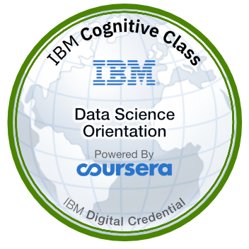
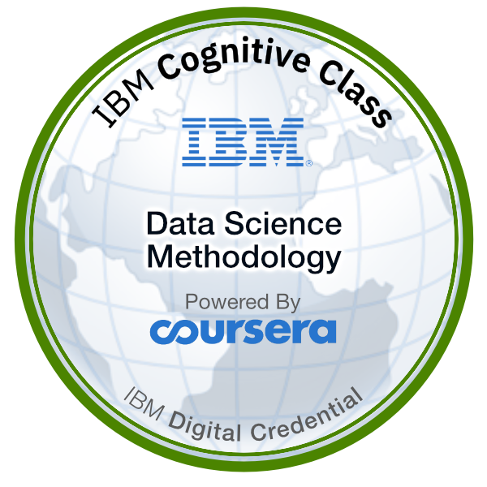
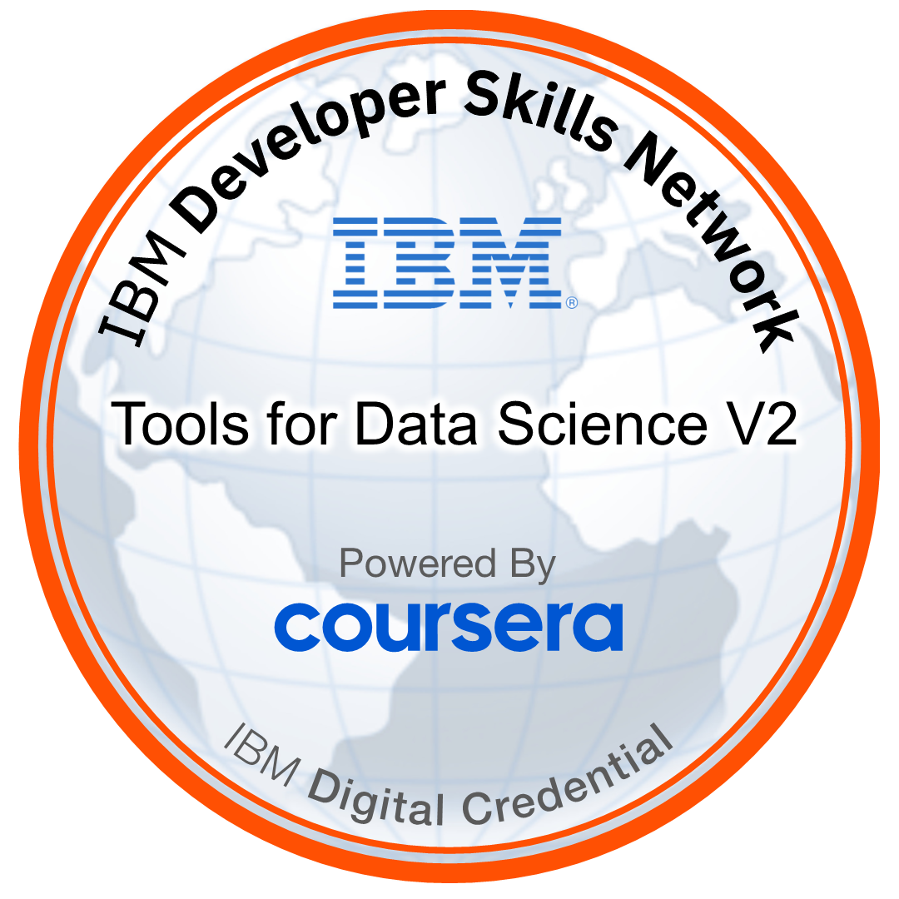
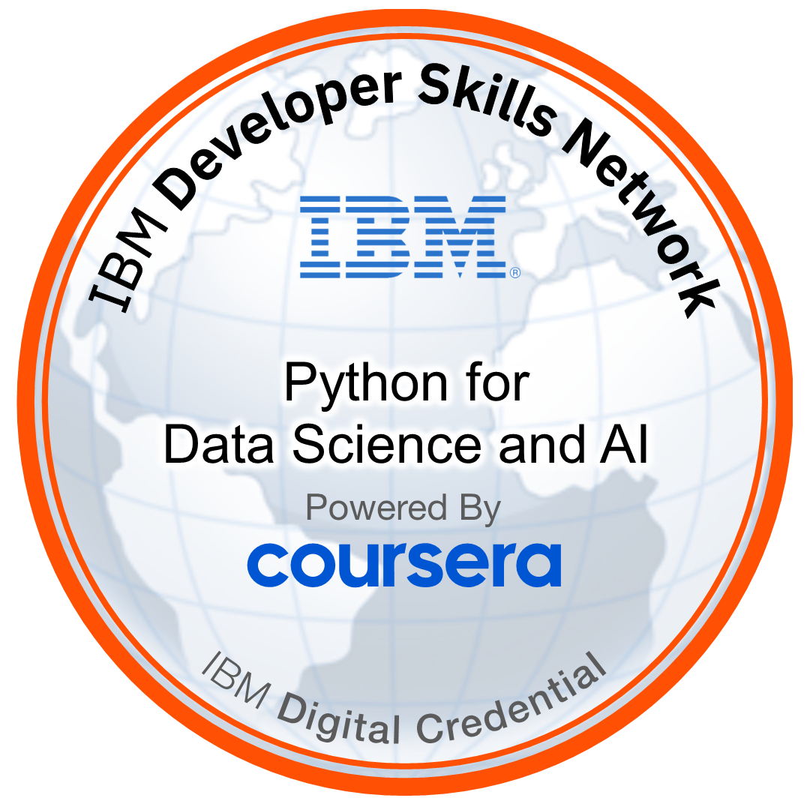
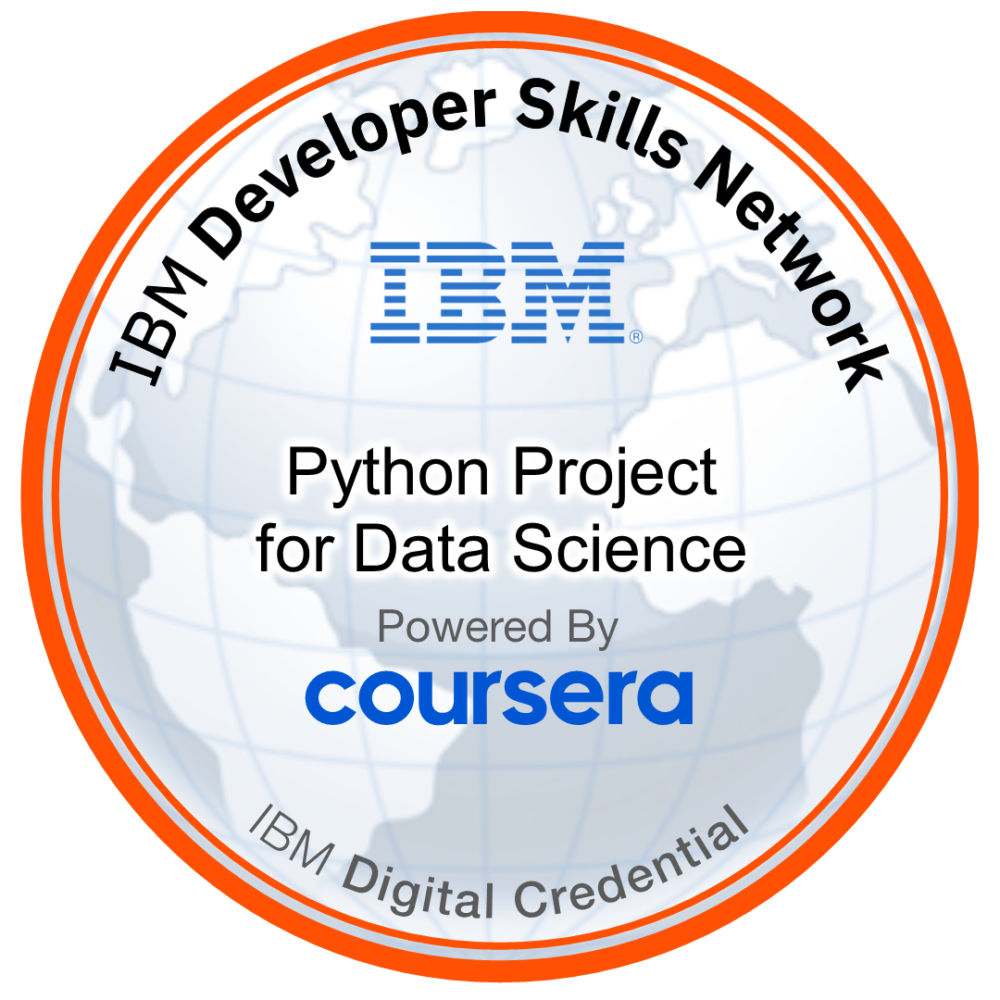

<div align="center">


<a href="https://github.com/MohtashimUsmani">
  
</a>

<br/>


</div>

<br/>

## 👨‍💻 About Me

```yaml
name: Mohtashim Usmani
role: Aspiring Data Scientist & Python Developer
education: BS in FinTech
current_focus: IBM Data Science Professional Certificate (5/12 courses completed)
learning: [Machine Learning, SQL, Statistics, Data Visualization]
background: Full Stack Development
goal: "Solve real-world business problems with data-driven solutions"
fun_fact: "I turn coffee ☕ into clean pipelines and cleaner dashboards"
```

- 🎓 BS FinTech Student
- 📚 Currently pursuing the **IBM Data Science Professional Certificate**
- 🐍 Python Developer with a Full Stack Development background
- 📊 Aspiring Data Scientist — learning ML, SQL, Statistics & Data Viz
- 🌱 Always building, always learning, always shipping
- 🎯 Goal: become a professional Data Scientist solving real-world problems

<br/>

## 🛠 Tech Stack

<div align="center">


<br/><br/>


</div>

<br/>

## 🏅 IBM Data Science — Badge Gallery

<div align="center">

*Click any badge to verify it on Credly*

<table>
  <tr>
    <td align="center" width="180">
      <a href="https://www.credly.com/badges/6229f69c-5672-43e8-8b44-f8c926a0af28/public_url">
        
      </a>
      <br/><b>Data Science<br/>Orientation</b>
    </td>
    <td align="center" width="180">
      <a href="https://www.credly.com/badges/7084ee89-755b-4e6a-a27e-27b94e3c140e/public_url">
        
      </a>
      <br/><b>Data Science<br/>Methodology</b>
    </td>
    <td align="center" width="180">
      <a href="https://www.credly.com/badges/af81f0a6-ad1f-4723-ab1c-9c504de94784/public_url">
        
      </a>
      <br/><b>Tools for<br/>Data Science</b>
    </td>
  </tr>
  <tr>
    <td align="center" width="180">
      <a href="https://www.credly.com/badges/f51e19ce-3f0c-4a48-a536-9d7b0c83b1eb/public_url">
        
      </a>
      <br/><b>Python for Data<br/>Science & AI</b>
    </td>
    <td align="center" width="180">
      <a href="https://www.credly.com/badges/ef345789-a594-418d-9cea-e6de974151ad/public_url">
        
      </a>
      <br/><b>Python Project for<br/>Data Science</b>
    </td>
    <td align="center" width="180">
      <a href="https://www.credly.com/users/mohtashim-usmani/badges">
        
      </a>
      <br/><b>More badges<br/>on the way</b>
    </td>
  </tr>
</table>

</div>
<br/>

## 📚 IBM Data Science Professional Certificate — Progress

<div align="center">


</div>

| # | Course | Status |
|:-:|---|:-:|
| 1 | Data Science Orientation | ✅ Done |
| 2 | Tools for Data Science | ✅ Done |
| 3 | Data Science Methodology | ✅ Done |
| 4 | Python for Data Science & AI | ✅ Done |
| 5 | Python Project for Data Science | ✅ Done |
| 6 | Databases and SQL for Data Science | ⬜ Upcoming |
| 7 | Data Analysis with Python | ⬜ Upcoming |
| 8 | Data Visualization with Python | ⬜ Upcoming |
| 9 | Machine Learning with Python | ⬜ Upcoming |
| 10 | Applied Data Science Capstone | ⬜ Upcoming |
| 11 | Generative AI: Elevate your Data Science Career | ⬜ Upcoming |
| 12 | Data Scientist Career Guide & Interview Prep | ⬜ Upcoming |

<br/>

## ⭐ Featured Projects

| Project | Description |
|---|---|
| [💳 **FinTech Fraud Detection Pipeline**](https://github.com/MohtashimUsmani/FinTech-Fraud-Detection-Pipeline) | Enterprise-style fraud detection using Python & Machine Learning |
| [📊 **SQL Data Analyst Project**](https://github.com/MohtashimUsmani/SQL-Data-Analyst-Project) | CTEs, Window Functions, Data Cleaning & Business Insights |
| [🌐 **Django CMS Web Application**](https://github.com/MohtashimUsmani/Django-CMS-WebApp) | Authentication, CRUD, PostgreSQL & Responsive UI |
| [📈 **Tesla vs GameStop Stock Analysis**](https://github.com/MohtashimUsmani/Gamestop-stock-vs-Tesla) | IBM Data Science guided project on financial data analysis |

<br/>

## 📊 GitHub Analytics

<div align="center">


</div>

### 🏆 Trophies

<div align="center">


</div>

### 🐍 Contribution Snake

<div align="center">


</div>

<br/>

## 🌍 Connect With Me

<div align="center">

[](https://www.linkedin.com/in/mohtashim-usmani/)
[](https://www.mohtashimusmani.me)
[](https://www.credly.com/users/mohtashim-usmani/edit/badges/credly)
[](mailto:mohtashimusmani09@gmail.com)

</div>

<br/>

<div align="center">

> *"Learning never exhausts the mind. It only prepares it for bigger challenges."*


</div>
